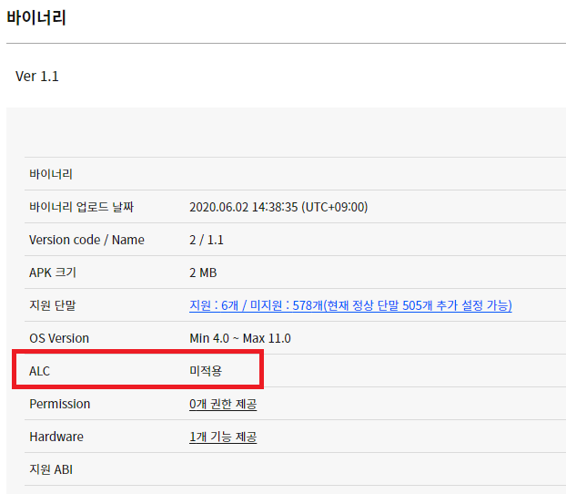

# ALC 개발 가이드

## **원스토어 Application License Checker 소개**

### **ALC 소개** 

원스토어는 애플리케이션에 대한 라이선스 정책을 적용할 수 있도록 라이선스 서비스(Application License Checker)를 제공합니다. ALC 서비스를 통해 앱을 사용하는 고객이 유효한 라이선스를 보유하고 있는지 실시간으로 확인한 다음 적절히 추가 사용여부를 판단할 수 있습니다.  원스토어 ALC는 네트워크 기반 서비스로, 현재 사용자가 유효한 라이선스를 보유하고 있는지 판단하기 위해 원스토어 서버에 질의하여 판단합니다. 해당 질의는 애플리케이션이 단말에 설치되어 있는 원스토어 서비스 (ONE store service)에 요청을 하고, 원스토어 서비스 (ONE store service)는 원스토어 서버에 요청을 보내고 결과를 수신하게 됩니다.\
.png>)

### ALC 라이브러리

애플리케이션에서 손쉽게 라이선스를 확인할 수 있도록 다운로드 가능한 라이브러리를 제공합니다.\
라이브러리는 애플리케이션이 원스토어 서비스 (ONE store service) 및 원스토어 서버와의 통신에 필요한 모든 기능을 담당하게 되며,\
애플리케이션은 라이브러리에서 제공된 api를 이용하여 사용자의 라이선스 유효성을 확인하면 됩니다

## **개발 및 테스트 환경설정**

### 권장 개발 환경&#x20;

애플리케이션에 ALC 라이브러리를 적용하기 위해 다음과 같은 개발 환경이 필요합니다.\
\- Android 5.0 이상 버전(API 버전 21 이상)\
\- Java SDK 1.6 버전\
\- Android studio 3.0 이상 버전

### **설정하기** 

* #### **Step 1.** Apps > '상품등록' 을 통해 등록할 상품과 패키지 네임을 입력합니다. 
*   **Step 2.**등록하신 앱 선택 후, '상품현황' > '라이선스 관리' 메뉴를 통해 라이선스 키(public key)를 확인합니다. 라이선스 키는 ALC 라이브러리를 사용할 때 필요한 반드시 필요한 항목입니다.\
    \
    \

    <figure><figcaption></figcaption></figure>
* **Step 3.** 라이브러리 적용 가이드에 따라 애플리케이션을 개발합니다. 라이브러리 가이드는 [여기](https://dev.onestore.co.kr/wiki/ko/doc/alc-application-license-checker-v2-39945595.html)를 참고하시기 바랍니다.
*   **Step 4.** 애플리케이션을 판매하기 전에 라이선스 적용 여부를 확인할 수 있습니다. '라이선스 관리' 메뉴의 'ALC 테스트 관리' 를 통해 테스터를 등록할 수 있습니다. 테스터를 등록하게 되면 해당 애플리케이션의 구매 여부와 관계없이 해당 테스터에게 애플리케이션에 대한 정상적인 라이선스가 존재하는 것으로 처리되며, 테스터 삭제 시 라이선스도 삭제된 것으로 처리됩니다.\

    <figure><figcaption></figcaption></figure>

> * 테스트 ID로 사용 할 테스트 ID(원스토어 사용자 계정)를 조회합니다.\
>   \* 원스토어에 등록된 계정을 테스트 계정으로 등록해 주십시오. (지원가능한 ID 타입 : 원스토어, 네이버, facebook, 구글 아이디)
> * 조회 된 테스트 ID 확인 후 '등록' 버튼을 선택하여 테스터로 등록해주세요. 등록된 테스터는 테스트 ID 관리를 통해 삭제를 진행 할 수 있습니다.

* **Step 5.** 판매를 위해 APK를 업로드 하고 ALC 적용 여부를 확인하실 수 있습니다.
  * 적용 시 : 라이브러리 내 api 버전이 노출 됨(ex. 1)
  *   미적용 시 : 미적용 으로 노출 됨\

      <figure><figcaption></figcaption></figure>

> 적용전 유의사항
>
> * ALC 라이브러리를 적용하기에 앞서 아래 내용을 확인하기 바랍니다.
>   * ALC 테스터 등록은 단일 어플리케이션에만 적용됩니다. 서로 다른 애플리케이션에서 ALC 테스트를 진행하기 위해서는 해당 상품의 ‘라이선스 관리’ 메뉴에서 새롭게 테스터 등록을 해야 합니다
>   * ALC 테스트 환경은 In-App 테스트를 위한 Sandbox와 무관합니다.
>   * 원스토어 서비스 (ONE store service)가 해당 사용자 디바이스에 설치되어 있어야 합니다. 통신사에서 유통하는 단말은 기본적으로 원스토어 서비스 (ONE store service)가 탑재되어 있으나, 자급제 및 해외향 단말에는 기본탑재가 되어 있지 않으니 아래 링크를 통해 최신 버전을 다운로드 해야 합니다.\
>     [원스토어 서비스 다운로드 하기](http://m.onestore.co.kr/mobilepoc/etc/downloadGuide.omp?PrePageNm=/main)

## **ALC 다운로드**

ALC(Application License Checker) 라이브러리는 [여기](https://github.com/ONE-store/app\_license\_check)에서 다운로드 받으실 수 있습니다.

\
